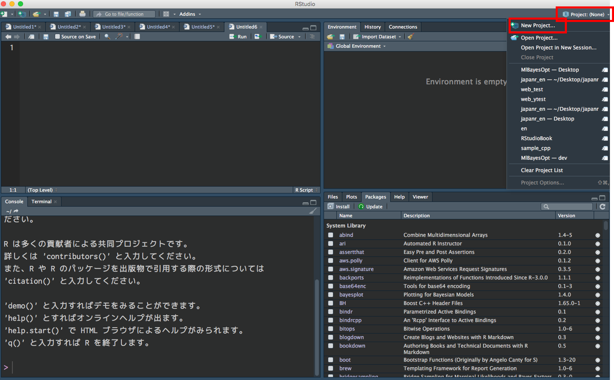
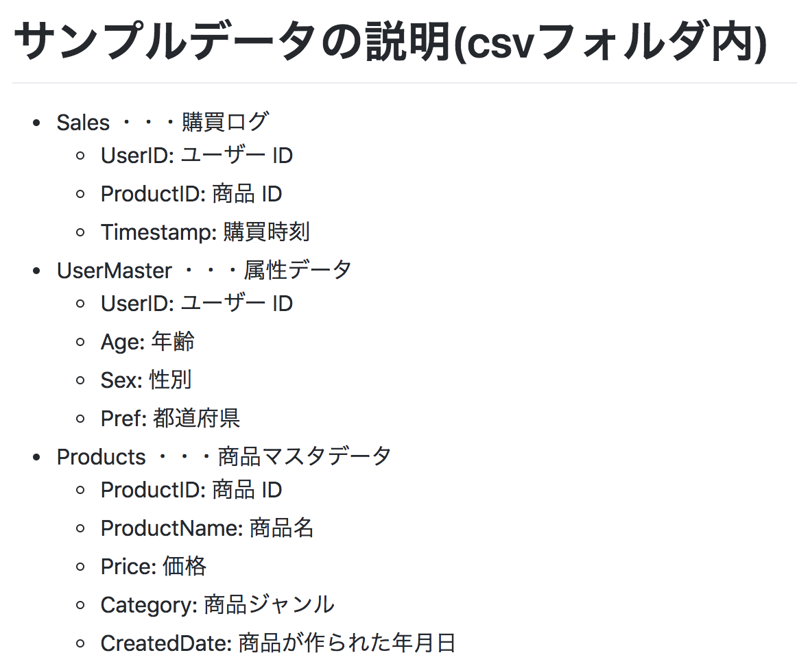
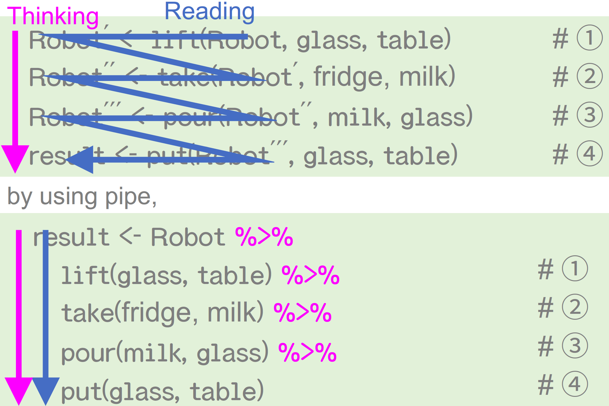

```{r setup, include=FALSE}
knitr::opts_chunk$set(echo = TRUE,
                      eval = TRUE,
                      warning = FALSE,
                      message = FALSE,
                      comment = "",
                      fig.height = 10,
                      fig.width = 10,
                      out.height = 300,
                      out.width = 300)
options(dplyr.print_max = 1e9)
```

# はじめに

## 誰？

<div class="column1">
- 松村優哉
- <u>Twitter</u>: **y\_\_mattu**
- 人材・HR Tech系で働くデータ屋さん
- 学生時代: 計量経済学、ベイズ統計、因果推論、マーケティング
- R歴: 6年目
- https://ymattu.github.io/
- http://y-mattu.hatenablog.com/
- Tokyo.R 運営(初心者セッションとか)
</div>

<div class="column2">

</div>

## 著書(共著)
#### **R ユーザのための RStudio[実践]入門 <br> − tidyverse によるモダンな分析フローの世界−**
<div class="column1">

</div>

<div class="column2">
通称: 「**宇宙本**」

1. RStudio 入門(@y\_\_mattu)
2. スクレイピングによるデータ取得(@y\_\_mattu)
3. dplyr を中心としたデータハンドリング(@yutannihilation)
4. ggplot2 による可視化(@kyn02666)
5. R Markdown によるレポーティング(@kazutan)

</div>

## この資料の目的
- R 初心者（触ったことはあるけど、なんかよくわからない）が、雰囲気を掴む

## Contents {#contents}
- R と RStudio について 
- tidyverse について
- テーブルデータの読み込み
- データハンドリング
- 統計学・モデリング・可視化については触れません。

## 注意 {#attention}
- わりと駆け抜けます
- 参考リンクも多いので資料は後でじっくり御覧ください。
- パッケージ名だけでも覚えてかえっていただけると嬉しいです。

# RとRStudioについて {#r_and_rstudio}
## Rとは {#aboutR}
- 統計解析およびその周辺環境に強いプログラミング言語
    - データの読み込み（ローカル, Webページ, DB）
    - データハンドリング
    - モデリング
    - 可視化
- 最近はWebアプリを作れたり、いろいろできるようになってきた
- プログラミング未経験でも始めやすい(個人的の感想) 


## R の環境構築 {#installR}
- R のインストールは、[CRAN](https://www.r-project.org/)から、自分のOSに合ったものを。
- 2020/8/1時点の最新版は、4.0.2
- 3.X.X→4.X.Xの変更点
    - [R 4.0.0 リリース - Qiita](https://qiita.com/piccolist/items/80f47a11d68dfe904cca)
    - [R 4.0.0 の破壊的変更まとめ - Qiita](https://qiita.com/five-dots/items/6dc28ece9afa5b1b053c)


- おすすめのIDE（統合開発環境）は、[RStudio](https://rstudio.com/)

## R のパッケージ {#packages}
- R のパッケージを使うことで、世界中で開発されている便利な手法を使える
- パッケージに含まれている関数を呼び出すことで、様々な拡張機能を使う
- パッケージは、関数の集まり
- CRANに登録されているものは、`install.packages("パッケージ名")` でインストール
    - 例: `install.packages("ggplot2")`

## パッケージ内の関数の表記
- **readr** パッケージの read_csv 関数を使いたいとき
```{r eval=FALSE}
# 方法 1
library(readr)
dat <- read_csv("hoge.csv")
# 方法 2
dat <- readr::read_csv("hoge.csv")
```

# tidyverse {#tidyverse}
## tidyverse について {#abouttidyverse}
### tidyverse(概念)
ざっくり:

- R でやるいろんな操作(データハンドリング、可視化、スクレイピング、分析、etc)を直感的で統一的なインターフェースでできるようになったら嬉しくない?

### **tidyverse** パッケージ
- 上記の概念を実現するためのコアパッケージ群
- `install.packages("tidyverse")`でインストール

## tidyverse を読み込み {#library_tidyverse}
<div class="column1">
```{r,message=TRUE}
library(tidyverse)
```
</div>

<div class="column2">
読み込まれるパッケージ

- ggplot2: 可視化
- dplyr: データの操作
- tidyr: データを tidy に
- readr: データの読み書き
- purrr: 関数型プログラミング
- stringr: 文字列の操作
- forcats: 因子型データの操作
- tibble: tibble というモダンなデータフレーム
</div>

# データの読み込み

## R でのデータ読み込みのベストプラクティス {#bestpractice}
0. RStudio でプロジェクトを作成
    - ファイルの位置が分かりやすくなります
1. 様々な読み込み関数を使って読み込み
    - **ローカルにあるファイル**(今日の中心)
    - **データベース**(パッケージの紹介のみ)
    - Web スクレイピング(またの機会に...)

# RStudio でプロジェクトを作成
## Project → New Project


## New Directory → New Project {#newproj}
<div class="column1">

</div>

<div class="column2">

</div>

## ディレクトリ名を入力


## Done!
- 読み込みの関数は、プロジェクトの中のファイルを探しにいきます。
- 書籍によっては `setwd()` を書いているものもありますが、RStudioプロジェクトでは必要ありません。

# いよいよデータの読み込み


# ローカルにあるファイル

# csv
## `read.csv()`
- パッケージを使わない方法
```{r eval=FALSE}
dat <- read.csv("sample.csv")
```

- R < 4.0.0 では `stringsAsFactors = TRUE` がデフォルトになっているので、`stringsAsFactors = FALSE` をつけることを推奨します。

```{r eval=FALSE}
dat <- read.csv("sample.csv", stringsAsFactors = FALSE)
```

## `readr::read_csv()`
- 高速で、列の型をいい感じにやってくれる(オススメ)
```{r eval=FALSE}
dat <- readr::read_csv("sample.csv")
```

## `data.table::fread()`
- `readr::read_csv()`
よりも高速
- デフォルトでは、data.table というデータフレームとは別の形で読み込まれるのでデータフレームがいいときは `data.table = FALSE`

```{r eval=FALSE}
library(data.table)
dat <- fread("sample.csv", data.table = FALSE)
```

# 高速ってどのくらい速いの？

## 速度検証
<div class="column1">
### 検証用データ
- ECサイトのログデータ <br> (を意識して作ったデータ)
- csv
- 100 万行× 3 列
- 約 45MB
- https://github.com/ymattu/SampleData
</div>

<div class="column2">
### 検証環境
- macOS Mojave 10.14.6
- Corei7
- メモリ 16GB
- R 3.6.3
</div>

## 時間を計測
```{r eval=TRUE}
system.time(dat <- read.csv("data/Sales.csv"))
system.time(dat2 <- readr::read_csv("data/Sales.csv"))
system.time(dat3 <- data.table::fread("data/Sales.csv"))
```

## もっとちゃんと時間を知りたい
- **microbench** パッケージ
- 比較したい関数を1000回ずつとか実行して見やすく表示してくれる

```{r, eval=FALSE}
library(microbenchmark)
file <- "data/Sales.csv"
compare <- microbenchmark("read.csv()" = read.csv(file),
                          "readr::read_csv()" = readr::read_csv(file),
                          "data.table::fread()" = data.table::fread(file),
                          times = 1000)
```

```{r, echo=FALSE}
library(ggplot2)
library(microbenchmark)
compare <- readr::read_rds("inst/compare.RData")
```


## 結果1 {#result1}
```{r, eval=FALSE}
compare
```
|expr                |       min|        lq|      mean|    median|        uq|      max| neval|
|:-------------------|---------:|---------:|---------:|---------:|---------:|--------:|-----:|
|read.csv()          | 1871.3155| 2222.0066| 2361.4660| 2347.1315| 2452.3060| 4529.984|  1000|
|readr::read_csv()   |  548.7358|  811.9076|  882.2824|  860.2287|  935.6320| 1759.994|  1000|
|data.table::fread() |  557.9172|  617.1047|  648.5004|  643.6659|  664.1492| 1138.720|  1000|

## 結果2 {#result2}
```{r, echo=FALSE, fig.height = 10,fig.width = 30,}
autoplot(compare)
```

# tsv
## `read.delim()`
- `read.delim()`は区切り値のファイルを読む標準関数
- `read.csv()`は `sep = ","`をつけたもの
```{r eval=FALSE}
# R < 4.0.0ではstringsAsFactors = FALSEを忘れずに
dat <- read.delim("sample.tsv", stringsAsFactors = FALSE)
```

## `readr::read_tsv()`
```{r eval=FALSE}
library(readr)
dat <- read_tsv("sample.tsv")
```

## `data.table::fread()` {#fread2}
- 区切り値は勝手に判断
```{r eval=FALSE}
library(data.table)
dat <- fread("sample.tsv", data.table = FALSE)
```

# その他の区切り値

## `read.delim()`
```{r eval=FALSE}
# R < 4.0.0ではstringsAsFactors = FALSEを忘れずに
dat <- read.delim("sample.tsv", stringsAsFactors = FALSE, sep = "|")
```

## `readr::read_delim()`
```{r eval=FALSE}
dat <- readr::read_delim("sample.tsv", "|")
```

## `data.table::fread()` {#fread3}

```{r eval=FALSE}
dat <- data.table::fread("sample.tsv", data.table = FALSE)
```

# 結局？
## どれがいいのか
- **readr**パッケージの `read_***()`関数が一番オススメ
- 速い、エンコーディングの調整が難しくない(後述)

|                        | read.\*\*\* | read_\*\*\* | fread |
|------------------------|----------|----------|-------|
| 速さ(45MB)            | 3秒    | 0.8 秒      |  0.6秒   |
| 区切り値の判定ミス   | ×        | ×        | △     |
| エンコーディング | ○        | ○        | △     |

# xlsx, xls
## エクセルファイル
### エクセルファイルを読み込めるパッケージ
- xlsx
- gdata
- XLConnect
- openxlsx
- **readxl** → オススメ(速い、列の型をいい感じに読める)

## 読み込み方
```{r eval=FALSE}
dat <- readxl::read_excel("sample.xlsx", sheet = "シート名")
# シート名はシート番号でも OK
```

# その他の拡張子
## SAS(.sas7bdat), STATA(.dta), SPSS(.sav)形式
**haven** パッケージで読み込み

#### SAS
```{r eval=FALSE}
dat <- haven::read_sas("sample.sas7bdat")
```

#### STATA
```{r eval=FALSE}
dat <- haven::read_dta("sample.dta")
```

#### SPSS
```{r eval=FALSE}
dat <- haven::read_sav("sample.sav")
```

# 文字コードの指定
## エンコーディング問題
- Windows の文字コードは **Shift-JIS（CP932）**
- Mac の文字コードは **UTF8**
- Windows で作られた（日本語を含む）ファイルを Mac で読むときは `Encoding=cp932`
- Mac で作られた（日本語を含む）ファイルを Windows で読むときは `Encoding=UTF8`

## csv を CP932 で読む
### R の標準関数
```{r eval=FALSE}
dat <- read.csv("sample.csv", stringAsFactors = FALSE, fileEncoding = "cp932")
```

### readr
```{r eval=FALSE}
dat <- readr::read_csv("sample.csv", locale = locale(encoding = "cp932"))
```

### data.table
```{r eval=FALSE}
dat <- data.table::fread("sample.csv", data.table = FALSE) %>%
  dplyr::mutate(VAR1 = iconv(VAR1, from = "UTF8", to = "CP932"))
```

# 関数とかオプションとか <br> 覚えられない
## RStudio の GUI 読み込み {#importdataset1}


## RStudio の GUI 読み込み {#importdataset2}


# データベース(クラウド)編
## データベースやクラウド上のデータ
- 企業にデータは膨大なのでクラウドにデータを置くことがとても多い
- こういうデータを R から直接触れたら嬉しいですよね！

## 便利パッケージたち
- **DBI**(データベースへの接続)
- **dplyr(dbplyr)**(データベースのテーブル操作)
- **sparklyr**(Spark, AWS S3)
- **bigrquery**(Big Query)
- RStudio の Connection タブ

## データベース関連の参考資料たち
- [dplyr でデータベース操作](https://qiita.com/nozma/items/f9a20d9ce0f7bfbdf628)
- [PostgreSQL からスキーマを指定してデータを参照する](https://qiita.com/uri/items/5a90f1c1c5edc8813c01)
- [これからはコネの時代](https://speakerdeck.com/yutannihilation/korekarahakonefalseshi-dai)

# Web スクレイピング
## 時間がないので省略
<div class="column1">

</div>

<div class="column2">

</div>


# もっといろいろ読み込めないの？
## R は他にもいろいろなデータを読み込めます {#others}
- 地理情報データ
- 画像
- 音声
- etc...

ググると、意外といろいろ出てきます

# データハンドリング {#datahandling}

## データハンドリングでやること、例えば {#datahandling_todo}
- 縦横変換
- 絞り込み(列・行)
- 新しい変数の作成
- 集計
- テーブルのマージ
- etc...
→分析できる形に整形

## データハンドリング編のコンテンツ {#datahandling_contents}
1. tidy data
2. dplyr
3. FAQ

## 本日の主役は {#shuyaku}
<div class="column1">


</div>

<div class="column2">
#### 特徴
パッケージを使わないやり方より

- (大きいデータだと特に) <br> 速い
- 簡単 <br> ≒　わかりやすい
- 他の tidyverse のパッケージと相性がいい
</div>

## データハンドリング編のゴール {#datahandlinggoal}
- tidy data についてざっくり理解する
- R の **dplyr** パッケージで簡単な集計ができるようになること
- dplyr や他のパッケージで何ができるのかをなんとなく把握して、「ググり力」を身につける


# tidy data {#tidydata}
## データの形式 {#data_format}
２つのデータ形式(例: カテゴリごとの購買金額(千円))

<div class="column1">
### Wide 型
```{r echo=FALSE}
dat_messy <- tibble(user = c('A', 'B', 'C'),
                    category1 = c(10, 15, 8),
                    category2 = c(2, 4, 5))
dat_messy %>%
  DT::datatable(extensions = 'FixedColumns',
  options = list(
    dom = 't',
    scrollX = TRUE,
    scrollCollapse = TRUE
  ))
```
</div>

<div class="column2">
### Long 型
```{r echo=FALSE}
dat_tidy <- dat_messy %>%
  gather(key = category, value = sum_price, -user)
dat_tidy %>%
  DT::datatable(extensions = 'FixedColumns',
  options = list(
    dom = 't',
    scrollX = TRUE,
    scrollCollapse = TRUE
  ))
```
</div>

## tidy data {#def_tidydata}
- 2016 年に Hadley Wickham 氏が提唱
- 定義
    - **1つの列が1つの変数を表す**
    - **1つの行が1つの観測を表す**
    - **1つのテーブルが1つのデータセットを含む**
- Rでのtidy data は、Long 型。

## tidyr 1.0.0 (2019/09/11〜) {#tidyr}


## 詳しくは 
[Tokyo.R #79 の応用セッション](https://speakerdeck.com/yutannihilation/tidyr-pivot ) を参照。

## 参考: tidyr (〜2019/09/11) {#tidyr_old}


# dplyr {#nowdplyr}

# 本日のデータ {#todaysdata}
## EC サイトのログデータ {#ecsitedata}
- を意識して作ったダミーデータ
- https://github.com/ymattu/sampledata_small


## データの読み込み方 {#prepare_data}
1. RStudio のプロジェクトを作成
2. Terminal ペインで以下を実行 <br> `git clone https://github.com/ymattu/sampledata_small`
3. readr パッケージの関数で読み込み
```{r }
sales <- read_csv("sampledata_small/csv/Sales.csv")
product <- read_csv("sampledata_small/csv/Products.csv")
user_master <- read_csv("sampledata_small/csv/UserMaster.csv")
```

# **dplyr** {#dplyr}
## 列選択 {#select}
```{r, eval=FALSE}
sales %>%
  select(UserID) %>%
  head()
```
```{r,echo=FALSE}
sales %>%
  select(UserID) %>%
  head() %>%
  DT::datatable(extensions = 'FixedColumns',
  options = list(
    dom = 't',
    scrollX = TRUE,
    scrollCollapse = TRUE
  ))
```

## %>% {#pipe}
#### パイプ演算子 {#pipe_operator}
- "これまでの処理を次の関数の第 1 引数として渡す」という働き"
```{r }
1:3 %>%
  sum()
```
```{r eval=FALSE}
# これと全く同じ
sum(1:3)
```


## どう書くのか問題 {#howtowrite}


## 思考の流れと書く流れ {#pipeline}


## パイプ演算子を使うときのポイント {#hint_pipe}
`結果 <- スタート地点` を書いて、やりたい処理をパイプでつないでいく

## 列選択のやりかたいろいろ 2 {#selectfunctions}
例
```{r eval=FALSE}
select(product, 1:3) # 列番号が連続している場合
select(product, ProductID:Price) # 列名でも連続していれば同様
select(product, -CreatedDate) # 特定の列を除く
select(product, -4) # 特定の列番号を除く
select(product, starts_with("p"), ignore.case = TRUE) # 大文字小文字を無視
select(product, matches("^(Product|Price)")) # "Product"または"Price"で始まる列を選択
```

## 列追加 {#mutate}
- 税込み価格を計算
```{r, eval=FALSE}
product %>%
  mutate(zeikomi = Price * 1.1) %>%
  head(4)
```
```{r, echo=FALSE}
product %>%
  mutate(zeikomi = Price * 1.1) %>%
  head(4) %>%
  DT::datatable(extensions =  'FixedColumns',
  options = list(
    dom = 't',
    scrollX = TRUE,
    scrollCollapse = TRUE
  ))
```

## 行の絞り込み {#filter}
```{r, eval=FALSE}
user_master %>%
  filter(Age >= 20, Sex == "F") # 年齢 20 歳以上の女性
```
```{r, echo=FALSE}
user_master %>%
  filter(Age >= 20, Sex == "F") %>%
  DT::datatable(extensions =  'FixedColumns',
  options = list(
    deferRender = TRUE,
    dom = "t",
    scrollX = TRUE,
    scrollY = 200,
    scrollCollapse = TRUE
  ))
```

## 集計
- グルーピング + 集計
```{r, eval=FALSE}
sales %>%
  group_by(UserID) %>%
  summarise(buy_count = n())
```
```{r, echo=FALSE}
sales %>%
  group_by(UserID) %>%
  summarise(buy_count = n()) %>%
  DT::datatable(extensions =  'FixedColumns',
  options = list(
    deferRender = TRUE,
    dom = "t",
    scrollX = TRUE,
    scrollY = 200,
    scrollCollapse = TRUE
  ))
```

# ここまでやったところで
## パッケージを使わないでできないの？{#withoutpackage}
- できるものもあります。
- select, filter あたりはできます。
- でもめんどくさい
- しかもデータが大きいと遅い
- このあたり、私の[過去資料](https://ymattu.github.io/TokyoR64/beginner/for_beginners.html#22)もみてね
- でも`$`はお手軽だしよく使います。

## `$`で 1 列だけ取り出す {#dollar}
```{r }
product$Category %>%
  unique()
```

# 日付の操作 {#date}
## **lubridate** パッケージ {#lubridate}
<div class="column1">

</div>
<div class="column2">
- 日付の操作をよしなにやってくれるパッケージ
```{r }
library(lubridate)
ymd("20110604")
ymd(20120101) + years(1)
```
詳しくは[こちら](http://estrellita.hatenablog.com/entry/2015/06/18/080651)や[こちら](http://estrellita.hatenablog.com/entry/2015/06/18/080651)を参照
</div>

## データハンドリングでの使い所 {#lubridate_dplyr}
たくさんあるけど例えば
```{r, eval=FALSE}
sales %>%
  mutate(buy_year = year(Timestamp)) %>%
  head()
```
```{r, echo=FALSE}
sales %>%
  mutate(buy_year = year(Timestamp)) %>%
  head() %>%
  DT::datatable(extensions =  'FixedColumns',
  options = list(
    deferRender = TRUE,
    dom = "t",
    scrollX = TRUE,
    scrollY = 200,
    scrollCollapse = TRUE
  ))
```

## ここから集計につなげる {#groupyear}
ユーザー、年ごとに集計
```{r, eval=FALSE}
sales %>%
  mutate(buy_year = year(Timestamp)) %>%
  group_by(UserID, buy_year) %>%
  summarise(buy_count = n()) %>%
  arrange(UserID) %>% 
  head()
```
```{r, echo=FALSE}
sales %>%
 mutate(buy_year = year(Timestamp)) %>%
 group_by(UserID, buy_year) %>%
 summarise(buy_count = n()) %>%
 arrange(UserID) %>%
 head() %>%
 DT::datatable(extensions =  'FixedColumns',
 options = list(
   deferRender = TRUE,
   dom = "t",
   scrollX = TRUE,
   scrollY = 200,
   scrollCollapse = TRUE
 ))
```

# その他、代表的な <br>（面倒くさい）型たち {#othertype}
## 文字列型 {#character}
- **stringr** パッケージ
- https://kazutan.github.io/kazutanR/stringr-intro.html

## 因子型(factor 型) {#factor}
- **forcats** パッケージ
- https://kazutan.github.io/kazutanR/forcats_test.html

# テーブルのマージ {#merge}
## 複数のテーブルを考える{#sometables}
<div class="column1">
### a
```{r echo=FALSE}
a <- data.frame(
  x1=c("A","B","C") ,
  x2=c(1,2,3)
)
a %>%
  DT::datatable(extensions = 'FixedColumns',
  options = list(
    dom = 't',
    scrollX = TRUE,
    scrollCollapse = TRUE
  ))
```
</div>
<div class="column2">
### b
```{r echo=FALSE}
b <- data.frame(
  x1=c("A","B","D") ,
  x3=c(TRUE , FALSE , TRUE)
)
b %>%
  DT::datatable(extensions = 'FixedColumns',
  options = list(
    dom = 't',
    scrollX = TRUE,
    scrollCollapse = TRUE
  ))
```
</div>

- 基本は SQL と同じ

## `inner_join()` {#innerjoin}
<div class="column1">
### a
```{r echo=FALSE}
a <- data.frame(
  x1=c("A","B","C") ,
  x2=c(1,2,3)
)
a %>%
  DT::datatable(extensions = 'FixedColumns',
  options = list(
    dom = 't',
    scrollX = TRUE,
    scrollCollapse = TRUE
  ))
```

### b
```{r echo=FALSE}
b <- data.frame(
  x1=c("A","B","D") ,
  x3=c(TRUE , FALSE , TRUE)
)
b %>%
  DT::datatable(extensions = 'FixedColumns',
  options = list(
    dom = 't',
    scrollX = TRUE,
    scrollCollapse = TRUE
  ))
```
</div>
<div class="column2">
```{r, eval=FALSE}
inner_join(a, b, by = "x1")
```
```{r, echo=FALSE}
inner_join(a, b, by = "x1") %>%
  DT::datatable(extensions = 'FixedColumns',
  options = list(
    dom = 't',
    scrollX = TRUE,
    scrollCollapse = TRUE
  ))
```
</div>

## `left_join()` {#leftjoin}
<div class="column1">
### a
```{r echo=FALSE}
a <- data.frame(
  x1=c("A","B","C") ,
  x2=c(1,2,3)
)
a %>%
  DT::datatable(extensions = 'FixedColumns',
  options = list(
    dom = 't',
    scrollX = TRUE,
    scrollCollapse = TRUE
  ))
```

### b
```{r echo=FALSE}
b <- data.frame(
  x1=c("A","B","D") ,
  x3=c(TRUE , FALSE , TRUE)
)
b %>%
  DT::datatable(extensions = 'FixedColumns',
  options = list(
    dom = 't',
    scrollX = TRUE,
    scrollCollapse = TRUE
  ))
```
</div>
<div class="column2">
```{r, eval=FALSE}
left_join(a, b, by = "x1")
```
```{r, echo=FALSE}
left_join(a, b, by = "x1") %>%
  DT::datatable(extensions = 'FixedColumns',
  options = list(
    dom = 't',
    scrollX = TRUE,
    scrollCollapse = TRUE
  ))
```
</div>

## `full_join()` {#fulljoin}
<div class="column1">
### a
```{r echo=FALSE}
a <- data.frame(
  x1=c("A","B","C") ,
  x2=c(1,2,3)
)
a %>%
  DT::datatable(extensions = 'FixedColumns',
  options = list(
    dom = 't',
    scrollX = TRUE,
    scrollCollapse = TRUE
  ))
```

### b
```{r echo=FALSE}
b <- data.frame(
  x1=c("A","B","D") ,
  x3=c(TRUE , FALSE , TRUE)
)
b %>%
  DT::datatable(extensions = 'FixedColumns',
  options = list(
    dom = 't',
    scrollX = TRUE,
    scrollCollapse = TRUE
  ))
```
</div>
<div class="column2">
```{r, eval=FALSE}
full_join(a, b, by = "x1")
```
```{r, echo=FALSE}
full_join(a, b, by = "x1") %>%
  DT::datatable(extensions = 'FixedColumns',
  options = list(
    dom = 't',
    scrollX = TRUE,
    scrollCollapse = TRUE
  ))
```
</div>

## `anti_join()` {#antijoin}
<div class="column1">
### a
```{r echo=FALSE}
a <- data.frame(
x1=c("A","B","C") ,
 x2=c(1,2,3)
)
a %>%
 DT::datatable(extensions = 'FixedColumns',
 options = list(
   dom = 't',
   scrollX = TRUE,
   scrollCollapse = TRUE
 ))
```

### b
```{r echo=FALSE}
b <- data.frame(
  x1=c("A","B","D") ,
  x3=c(TRUE , FALSE , TRUE)
)
b %>%
  DT::datatable(extensions = 'FixedColumns',
  options = list(
    dom = 't',
    scrollX = TRUE,
    scrollCollapse = TRUE
  ))
```
</div>

<div class="column2">
```{r, eval=FALSE}
anti_join(a, b, by = "x1")
```
```{r, echo=FALSE}
anti_join(a, b, by = "x1") %>%
  DT::datatable(extensions = 'FixedColumns',
  options = list(
    dom = 't',
    scrollX = TRUE,
    scrollCollapse = TRUE
  ))
```
</div>

# FAQ {#faq}
## dplyr とかだと何で <br>R の標準関数より速いの？ {#whydplyrfas}
Answer : C++を使っているから

- **dplyr**や **readr**では、メインの処理を C++でやり、結果を R で受け取る、という構造になっています。
- **Rcpp** パッケージが活躍!

## たくさんのテーブルを join したい! {#reducejoin}
<div class="column1">
例えばこんな感じ(a, b, c 3 つのデータ)
```{r echo=FALSE}
library(dplyr)
a <- data.frame(
  x1=c("A","B","C") ,
  x2=c(1,2,3),
  stringsAsFactors = F
)
b <- data.frame(
  x1=c("A","B","D") ,
  x3=c(TRUE , FALSE , TRUE),
  stringsAsFactors = F
)
c <- data.frame(
  x1=c("B","C","D") ,
  x4=c(10, 11, 12),
  stringsAsFactors = F
)
a
b
c
```
</div>

<div class="column2">
こうする...?
```{r, eval=FALSE}
a %>%
  full_join(b, by = "x1") %>%
  full_join(c, by = "x1")
```
```{r, echo=FALSE}
a %>%
  full_join(b, by = "x1") %>%
  full_join(c, by = "x1") %>%
  DT::datatable(extensions = 'FixedColumns',
  options = list(
    dom = 't',
    scrollX = TRUE,
    scrollCollapse = TRUE
  ))
```
数が増えると大変!
</div>

## たくさんのテーブルを join したい! {#reducejoin2}
Answer : 初心者セッションの範囲をこえますが、<br>**purrr**パッケージを使うと簡単です。
```{r, eval=FALSE}
datlist <- list(a, b, c)
datlist %>%
  purrr::reduce(~full_join(.x, .y, by = "x1"))
```

**purrr** パッケージの参考資料→[そろそろ手を出す purrr](https://speakerdeck.com/s_uryu/nekosky)

# まとめ {#matome}
## 言いたいこと {#iitaikoto}
- （イマドキな）R でのデータ操作では `tidyverse` は必須
- 基礎的なことは Tokyo.R 初心者セッションや、宇宙本で!
- 応用は、まずパッケージ名を知ることから(purrr, broom, etc...)
- ぜひ使いこなせるようになりましょう。

## 本資料について
- revealjs パッケージで作りました。
- 以下の URL で公開しています。 <br> https://ymattu.github.io/TokyoR87/slide.html#/

## Enjoy! {#enjoy}
